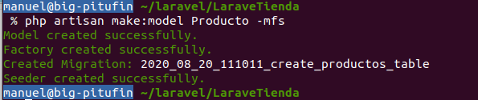

# Diseño de base de datos

# Creación de las migraciones y modelos
Ahora vamos a  generar las migraciones, modelos de la base de datos para la gestión de datos.

Igualmente para su población en pruebas crearemos los factory y seeders.

## Creación del modelo producto
 En la propia acción, con los parámetros __mfs__ creamos también su migración (__m__), factory (__f__) y seeder (__s__) migraciones de prouductos.

<code>
    php artisan make:model Producto -mfs
</code>
Se genera la siguiente salida

Ahora actualizamos la migración para cargar los campos que deseamos (Ver fichero creado database/migratios/2020_08_20_111011_create_productos_table.php)

<code>

      public function up()
        {
            Schema::create('productos', function (Blueprint $table) {
                $table->string("nombre");
                $table->string("descripcion");
                $table->string("imagen");
                $table->float("pvp");
                $table->id();
                $table->timestamps();
            });
        }
</code>

