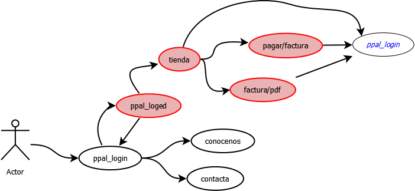
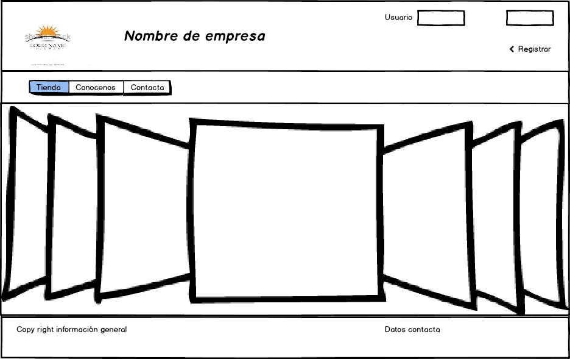
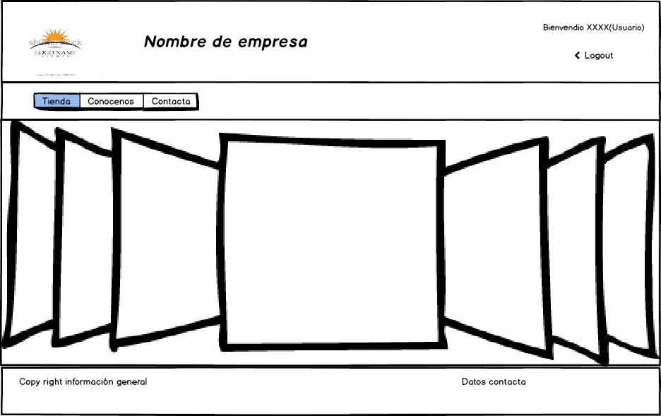
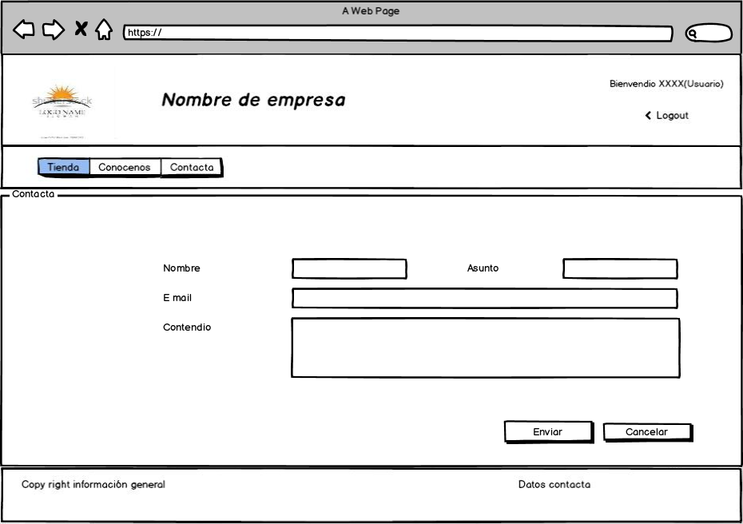
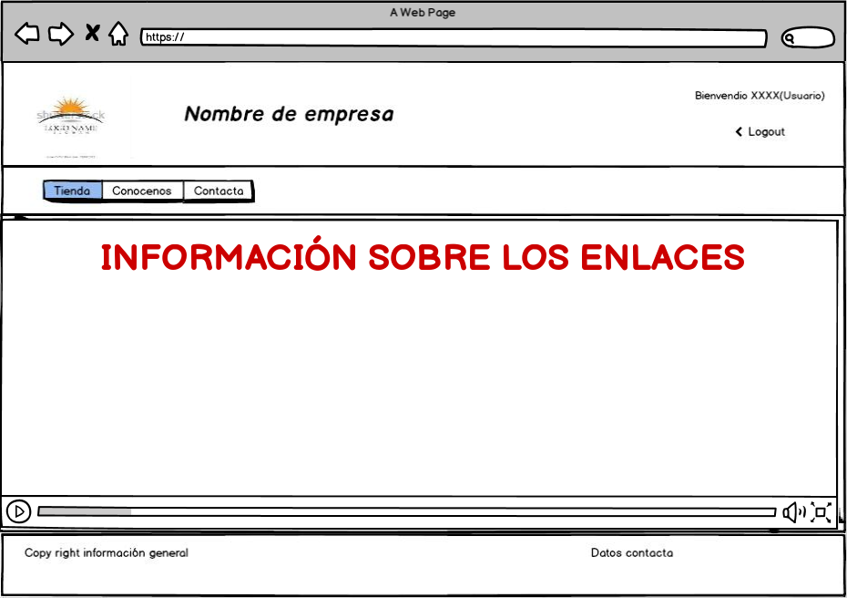
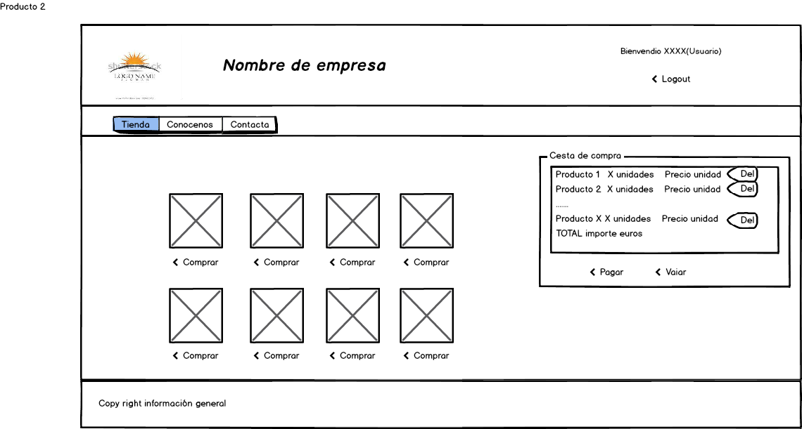
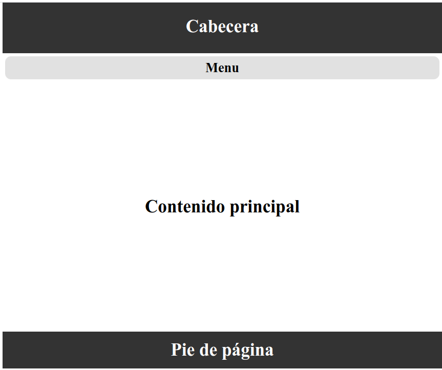
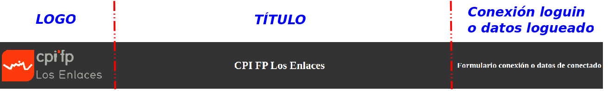
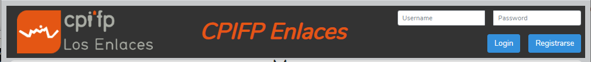
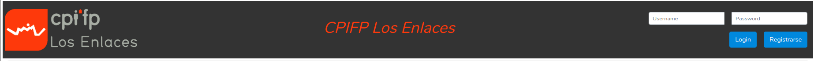

# DISEÑO DE PANTALLAS

 [](https://travis-ci.org/laravel/framework) [](https://packagist.org/packages/laravel/framework) [](https://packagist.org/packages/laravel/framework) [](https://packagist.org/packages/laravel/framework)

## LaravelTienda : Diseño de pantallas

Rehacemos la práctica de la tienda usando laravel y vamos especificando requisitos e implementación

## Planteamos el siguiente menú de navegación



 En __color rojo__  se representan aquellas pantallas o recursos que requieren estar logueado para acceder a ellas
 En cualquiere de ellas podremos desloguearnos

__A continuación vamos a ver los mockups o diseño de las pantallas__

## Diseño con balsamiq
Realizamos la siguiente propuesta de las diferentes pantallas:
* Pantalla __princial__
  * Tendremos la pantalla sin estar conectado
  
  * Y la pantalla principal si estamos conectado
    
* Pantalla de __contacta__

    
* Pantalla de __conocenos__

    
* Pantalla de __tienda__

    
* Pantalla de __pagar__
    
* Pantalla de __imprimir factura__

    


## Layout 

 Esta pantalla va a ser la base e todas las pantallas y corresponde al siguiente diseño
 Realizamos un típico diseño de 4 secciones. Especificamos el porcentaje en altura decidio para cada sección.
 * __header__ 15%: común en todas las páginas
 * __nav__   5%: (Menú de cabecera) común en todas las páginas
 * __main__   70% Cambiará según pantalla
 * __footer__ 10% común en todas las pantallas
 
 Para el diseño  establecemos una clase en css llamada  __container_main__ con un display flex. El contenido estará en el fichero de estilos.
 creamos el fichero __1.css__, según avancemos crearemos nuevos ficheros css, manteniendo los anteriores para poder visualizar cada parte intermedia del proyecto.
 
<code>
  
     .container_main {
          /*clase para la caja global => header(cabecera) + nav (menú de navegacin) + main(Cuerpo ppal)+
        footer (pie de la página) */
        display: flex;
        flex-flow:column;
        justify-content: center;
        padding: 5px;
        border: #1f6fb2 1px;
        background:white ;
        height:100vh;
     }
</code>
 
  Los elementos del flex llevarán un porcentaje de ocupación
  
  Establecemos una altura del container igual al viewport que corresponda a la pantalla
 
<code>
  
    height: 100vh; //v de viewport y h de height
</code>
Por el momento vamos a hacer que los contenidos estén centrados
<code>

       //El eje principal  y secundario depende del valor de flex-direcction row o column
        text-align: center; //Centrando el eje secundario (en este caso vertical)
        justify-items: center; //Centrado el eje principal (en este caso horizontal)
</code>
   
   Los __items__ del container (header, nav, main y foote) también serán containers de otros elementos quedando el css inicial


<code>
  
    header {
       height: 15%;
       background: rgb(51, 51, 51);
       color: white;
       border: black 1px;
       display: flex;
       flex-direction: row;
       justify-content: center;
       align-items: center;
    }
    nav {
       height: 5%;
       background:  rgb(225, 225,225);
       border-radius: 10px;
       display: flex;
       flex-direction: row;
       justify-content: center;
       align-items: center;
       padding: 3px;
       margin: 5px;
    }
    main {
       height: 70%;
       background: white;
       border: black 1px;
       display: flex;
       flex-direction: row;
       justify-content: center;
       align-items: center;
    }
    footer {
       display: flex;
       flex-direction: row;
       justify-content: center;
       align-items: center;
       color: white;
       height: 10%;
       background: rgb(51, 51, 51);
       border: black 1px;
    }
</code>
Para esta primera parte del proyecto, vamos a crear la siguiente plantilla blade (que será un layout principal en el proyecto)

<code>

    <!doctype html>
    <html lang="es">
    <head>
        <meta charset="UTF-8">
        <meta name="viewport"
              content="width=device-width, user-scalable=no, initial-scale=1.0, maximum-scale=1.0, minimum-scale=1.0">
        <meta http-equiv="X-UA-Compatible" content="ie=edge">
        <link rel="stylesheet" href="{{asset("./css/1.css")}}">
        <title>Tienda el Laravel</title>
    </head>
    <body>
    <div class="container_main">
        <header>
            <h1>Cabecera</h1>
        </header>
        <nav>
            <h1>Menú</h1>
        </nav>
        <main>
            <h1>Contenido principal</h1>
        </main>
        <footer>
            <h1>Pie de página</h1>
        </footer>
    </div>
    </body>
    </html>

</code>
En el ficheros de rutas creamos por comodidad la ruta __1.php__
<code>

    Route::view("1", "layouts/layout1");
</code>
   Esta sería la imagen del layout inicial
   

   
   
   * [Menú](menu.md)
   * [Contenido principal](./Doc/main.md)
   * [Footer o pie de página](./Doc/footer.md)
 
 ### Header
 Va a ser la __Cabecera__ de la pantalla.
 Vamos a tener tres secciones: 
  * Logo
  * Un título
  * Sección de logueo o de información de usuario logueado
  
   
 En ella vamos a establecer un  login, un título y una sección para menú de login o bien nombre de usuario logueado.
 
 Establecemos pues tres secciones distribuidas horizontalmente como mostramos en la siguiente imagen
 #### Logo
 Vamos a usar la imagen del cpifp los enlaces. La descargo de la página oficial 
      [Imagen logo de los enlaces](http://www.cpilosenlaces.com/wp-content/uploads/2014/11/logo_cpifp-300x116.png)
      
Guardo la imagen en un subdirectorio del dir __storage__.

Este directorio, como no está en la carpeta public, se debe de hacer un enlace directo a la carpeta public para tenerlo disponible.

Existe un comando que crea directamente el enlace directo   [Documentación laravel sobre link de storage](https://laravel.com/docs/7.x/filesystem#the-public-disk)

<code>

    php artisan storage:link
</code>
Le damos un poco de estilo para que no se salga de su contenedor __header__ si redimensionamos y para que esté alineado a la izquierda (ver public/css/2.css)
<code>

    header >.logo{
        margin: 10px;
        margin-left: 20px;
        max-height: 100%;
        }
</code>
En header modificamos la distribución de elementos
<code>

    header {
        //...
        justify-content: space-between;
        align-items: center;
</code>


#### Título
En este caso simplemente escribimos el texto __CPIFP Los Enlaces__ . Le damos un poco de estilo color, inclinado.
<code>

    header >.titulo{
        margin: 10px;
        margin-right: 20px;
        max-height: 100%;
        color :rgb(228, 86, 20);
        font-size: 3em;
        font-weight: bold;
        font-style: oblique;
    } 
<code>

#### Login o logueado
    
En este caso en la plantilla querríamos hacer algo del timp
<code>

    if (usuario logueado){
       mostar nombre
       mostar botón de deslogueo
    else
       mostar formulario login (cajas de texto y botón login)
       mostrar botón registar    
    }
</code>
Laravel tiene unas directivas en blade que realizan esta acción __@auth__ y __@guest__. Estas directivas equivalen a verificar si el usuario está o no autentificado 

https://laravel.com/docs/master/blade#if-statements, ver   authentication directive
    
Por lo tanto lo único que hemos de hacer en la plantilla escribir el código. Posteriormente en el apartado de autentificación probaremos su uso, de momento solo estamos en diseño 
<code>

    @guest
    {{--sección de no autentificación--}}   
    @endguest
    @auth
    {{--sección de autentificación--}}
    @endauth
<code>   
Ahora el código que ponemos (usamos un poco de bootstrap) para cada parte será el siguiente
   
De momento en el action del __si estoy autenticado__ será invocar a una ruta llamada __login__ que en la sección de autenticación especificaremos   
   
<code>
   
      @guest
         <form class="form-inline login-form d-flex flex-column justify-content-sm-end align-items-end " action="{{route("login")}}" method="post">
           <div class="input-group input-group-sm justify-content-sm-end d-flex flex-row  ">
                 <input type="text" class=" p2 form-control col-sm-6 m-2" placeholder="Username" required>
                 <input type="text" class="p2 form-control col-sm-6  m-2" placeholder="Password"required>
           </div>
           <div class="input-group-sm justify-content-sm-end d-flex flex-row   ">
               <button type="submit" class="p2 btn btn-primary m-2">Login</button>
               <button type="submit" class="p2 btn btn-primary m-2">Registrarse</button>
           </div>
        </form>
      @endguest
      @auth
         <!--Código si está atentificado --> 
      @endauth
</code>
Podemos ver la siguiente imagen del menú de login


   
En caso de estar conectado, debemos mostar el nombre del usuario conectado y la opciòn de desconexión
   
Para acceder al nombre del usuario conectado en la vista, podemos acceder a la facade __Auth__ . En este caso los datos del usuario estarán en la tabla __user__, y el nombre será el campo __name__
   
Todos estos aspectos se considerarán en la sección de autentificación.
   
<code>
   
      @auth
       Auth::user()->name
        <!--Código si está atentificado --> 
       @endauth
</code>
 ara esta primera parte del proyecto, vamos a crear la siguiente plantilla blade (que será un layout principal en el proyecto)
 
 __laravel3.blade.php__
 
 <code>
 
    <html lang="en">
    <head>
     <meta charset="UTF-8">
     <meta name="viewport"
           content="width=device-width, user-scalable=no, initial-scale=1.0, maximum-scale=1.0, minimum-scale=1.0">
     <meta http-equiv="X-UA-Compatible" content="ie=edge">
     <link rel="stylesheet" href="{{asset("./css/app.css")}}">
     <link rel="stylesheet" href="{{asset("./css/3.css")}}">
     <title>App tienda</title>
    </head>
    <body>
    <div class="container_main">
     <header>
         <!-- El logo -->
         
         <div class="titulo">
             <h1>CPIFP Los Enlaces</h1>
         </div>
         <div class="usuario">
         @guest <!--Si no estoy logueado-->
             <form class="form-inline login-form d-flex flex-column justify-content-sm-end align-items-end "
                   action="{{route("login")}}"
                   method="post">
                 <div class="input-group input-group-sm justify-content-sm-end d-flex flex-row  ">
                     <input type="text" class=" p2 form-control col-sm-6 m-2" placeholder="Username"
                            required>
                     <input type="text" class="p2 form-control col-sm-6  m-2" placeholder="Password"
                            required>
                 </div>
                 <div class="input-group-sm justify-content-sm-end d-flex flex-row   ">
                     <button type="submit" class="p2 btn btn-primary m-2">Login</button>
                     <button type="submit" class="p2 btn btn-primary m-2">Registrarse</button>
                 </div>
             </form>
             @endguest
             @auth
                 <h2>Datos de conectado</h2>
             @endauth
         </div>
     </header>
     <nav>
         <h1>Menú</h1>
     </nav>
     <main>
         <h1>Contenido principal</h1>
     </main>
     <footer>
         <h1>Pie de página</h1>
     </footer>
    </div>
    </body>
    </html>
 </code>
 En el ficheros de rutas creamos por comodidad la ruta __1.php__
 <code>
 
     Route::view("2", "layouts/layout2");
 </code>
 La página que visualizamos sería
 
 
 
    Esta sería la imagen del layout inicial
 ### Menú
 
 
 ### Main
 ### footer
    
    
  

### Diseño de la interfaz gráfica

Usamos balsamiq para el diseño gráfico [Cómo usar balsamiq en ubuntu](https://github.com/balsamiq/balsamiq-wireframes-linux) descargamos y ejecutamos con el siguiente comando:

 `get` [`https://raw.githubusercontent.com/balsamiq/balsamiq-wireframes-linux/master/bw.yml`](https://raw.githubusercontent.com/balsamiq/balsamiq-wireframes-linux/master/bw.yml) `-O /tmp/bw.yml && lutris -i /tmp/bw.yml`

#### Página principal


Aquí vemos una sección de cabecera, un menú, un contendio y un pie de página Si el usuario estuviera conectado sólo cambiará el menú superior 

**Página de tienda**

En esta página solo se puede acceder si se está conectado. 

**Página de imprimir**

En esta página solo se puede acceder si se está conectado. 

**Página de pagar**

En esta página solo se puede acceder si se está conectado. 

**Página contacta**

En esta página solo se puede acceder si se está conectado. 

**Página conocenos**


**Página registrarse**


### Cargar Bootstrap en el proyecto

Vamos a usar bootstrap para partes del diseño de nuestro proyecto. Bootstrap [Referencia web en la página oficial](https://laravel.com/docs/7.x/frontend) Instalamos el paquete laravel/ui bien directamente  
 `composer require laravel/ui`

O bien lo incluimos en la sección require de composer.json y volvemos a orquestar

```text

 ``//.....
 "require": {
         "php": "^7.2.5",
         "fideloper/proxy": "^4.2",
         "fruitcake/laravel-cors": "^2.0",
         "guzzlehttp/guzzle": "^6.3",
         "laravel/framework": "^7.0",
         "laravel/tinker": "^2.0",
         "laravel/ui":"^2.0" 
    },``
```

Orquestamos

 `composer update`

Ahora instalamos bootstrap en local usando artisan, para ello realizamos los siguientes pasos \(ver la página oficial para las explicaciones más detalladas\)

```text

php artisan ui bootstrap 
npm install
npm run install
```

 Una vez realizada estas acciones podemos ver que tenemos disponible en la carpeta !\[ficheros creados tras la instalación de bootstrap\]\(./storage/imagenes/mockups/bootstrap\_js.png\) Ahora para poder usar bootstrap lo único que tenemos que hacer es referenciarlo en el fichero blade \#\# Realización de las plantillas con blade En esta apartado debemos realizar las plantillas de cada una de los mockups. Para ello vamos a crear la plantilla o layout que llevarán todas las página. !\[Layout general\]\(./storage/imagenes/mockups/Layout.png\) \# Autentificación Vamos a usar la autentificación que trae laravel por defecto, luego veremos cómo modificar alguna de estos valores por defecto, como será: - Cambiar los campos de usuarios registrados - Cambiar los campos de autentificación - Camibar el diseño de formuario para login \#\#Establecer la autentificación por defecto Para ello debemos de realizar una serie de pasos muy sencillos. Primero vamos a instalar esta autentificación para instalar los controladores necesarios

```text

 php artisan ui vue --auth
```

 Tras haber ejectuado este comando hemos instalado la autentificación qeu por defecto trae Laravel. Con ello tendremos instalado: - Rutas. Si abrimos el fichero web.php observamos

```text

     Auth::routes();
     Route::get('/home', 'HomeController@index')->name('home');
```

 - Vistas de login y de registro !\[Vistras creadas para la autentificación\]\(./public/imagenes/imagenes\_apuntes/vistas\_auth.png\) - Controlador para instalarlo: \_\_HomeController.php\_\_ y directorio \_\_Auth\_\_ !\[Conroladores antes de cargar auth\]\(./public/imagenes/imagenes\_apuntes/before\_\_auth.png\) !\[Conroladores después de cargar auth\]\(./public/imagenes/imagenes\_apuntes/after\_auth.png\) \_\_Qué podemos ver que ha ocurrido ahora\_\_ Si miramos \_\_web.php\_\_ vemos que si queremos acceder a /home, primero deemos estar autentificados Si abrimos un navegador y escribimos \_\_http://localhost:8000/home, nos redirije automáticamente a una página de logín ya que no estamos logueados Este es el efecto del middleware que se ha incluido en \_\_web.php\_\_ a través del controlador HomeController

```text

     public function __construct()
      {
          $this->middleware('auth');
      }

      /**
       * Show the application dashboard.
       *
       * @return \Illuminate\Contracts\Support\Renderable
       */
      public function index()
      {
          return view('home');
      }
```

Un middleware es un software intermedio que podemos establecer que se ejecute antes o después de una determinada acción En este caso le decimos que si se solicita una página verfique antes que se esté autentificado, y si no redirigimos a la autentificación de usuario Una vez que el usuario se haya autentificado devolveremos la página solicitada, en este caso **home**


Si damos a registrar nos aparecerá el formulario siguiente


Pero esto no funcionará, ya que primero hemos de crear las tablas en la base de datos para almacenar la información Para ello, laravel ya trae preparadas unas migraciones por defecto 

Preparamos la base de datos. Para ello establecemos en al fichero de configuración **.env** la configuracion de nuestra base de datos y de cómo acceder a ella 

Y ahora ejecutamos las migraciones, para ello, la primera vez ejectuamos las migraciones

```
 php artisan migrate:install 
```

Y ahora ejectuamos las migracione que tenemos pendientes que serían las tres que vienen por defecto en laravel para usar la autentificación

```
 php artisan migrate 
```

Ahora viene cuando queremos adaptar este logín a nuestra aplicación, es decir, queremos aprovechar esta infraestructura lógica, pero cambiar básicamente los tres aspectos que hemos comentado anteriormente 1. Formulario de login 2. Campos con los que nos logueamos 3. Campos de registro \(Mantenemos este formulario\)

#### Adaptando el formulario de login

\*En este caso no vamos a tener una página con el formulario, si no que es parte de la página principal El diseño de la página principal sin loguearse es

