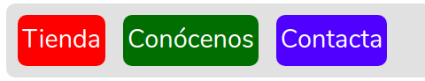

# Menú

  Van a ser las opciones de nuestra aplicación.
  
  Pondremos, según las especificaciones tres opciones, no es la parte principal, pero en la mayoría de los desarrollos, esta es una sección fundamental.
  
  Es importante tenerla bien identificada, pues es posible que queramo añadir o cambiar opciones durante la vida de nuestro desarrollo.
  
  Cómo ya decidimos en el diseño general, vamos a tener tres opciones
   
   * __Tienda__
   * __Conócenos__
   * __Contacta__
   
   Si vemos el menú de navegación, cada opción nos va a llevar a un nuevo recurso o página
   
   Alguno de ellos estará restringido a estar logueado, como abordaremos en la sección de autenticación
  
  En esta caso creamo sun menú con tres botones y damos este ces
 <code>
   
    .menu{
      display: flex;
      flex-flow:row;
      height: 10%;
      border-radius: 10px;
      padding: 3px;
      margin: 5px;
      background: rgb(225, 225, 225);
      justify-content: start;
    }

    nav>a:hover{
      color:black;
      font-size:2.1em ;
    }
    
    nav > a {
        font-size: 2em;
        border: #4c110f;
        background: #a71d2a;
        padding: 5px;
        margin: 10px;
        color:white;
        border-radius: 10px;
    }
    
 </code>

 
 Se crea la siguiente imagen (es la parte del menu)
  

 
 Que con la cabecera que ya había estamos en esta situación
 
 ## Ficheros realizados
 
  * __css__: *4_menu.css*
  * __plantilla__: layout_menu_4.blade.php
  * __ruta__: 
  
       <code>
            Route::view("4menu", "layouts/layout_menu_4");
       </code> 
 
 [Volver a diseño de pantalla](./../Doc/diseno_pantallas.md)
